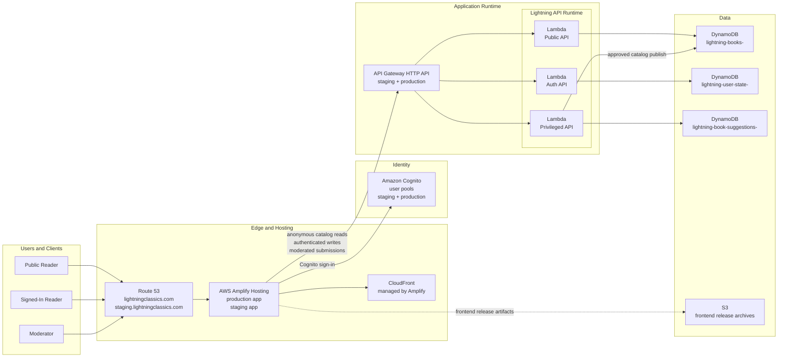
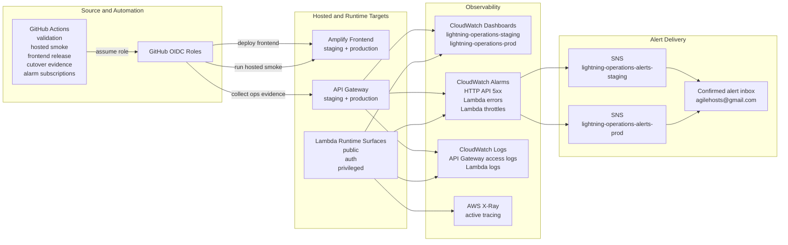

# Lightning Classics AWS Architecture Draft

## Purpose

This file is the first-pass diagram draft for Lightning Classics.

It is intentionally:

- easy to edit in markdown
- quick to review in GitHub
- suitable as a drafting source before producing the final AWS-icon diagram in draw.io

Use this draft together with:

- `docs/aws-diagram-blueprint.md`

## Diagram 1: System Overview

## Diagram 2: Operations and Delivery

## Draft Notes

- This draft is for structure and review, not final presentation.
- The final polished version should use standard AWS icons in draw.io.
- Keep the final visual split into:
  - overview
  - operations and delivery

## Next Step

Translate this draft into:

- `docs/diagrams/lightning-aws-architecture.drawio`

Then export:

- `docs/diagrams/lightning-aws-architecture-overview.svg`
- `docs/diagrams/lightning-aws-architecture-operations.svg`
