# Lightning Classics AWS Architecture Draft

## Purpose

This file is the presentation-oriented Mermaid draft for Lightning Classics.

It is meant to be:

- clean enough to review in GitHub or present internally
- structurally aligned with the live AWS system
- easy to translate into a polished AWS-icon diagram in draw.io

Use this draft together with:

- `docs/aws-diagram-blueprint.md`
- `docs/aws-diagram-presentation-playbook.md`

## Diagram 1: System Overview

```mermaid
%%{init: {"theme":"base","themeVariables":{"background":"#fbf7ef","primaryColor":"#fffaf0","primaryTextColor":"#1f2937","primaryBorderColor":"#94a3b8","lineColor":"#475569","secondaryColor":"#f8fafc","tertiaryColor":"#eff6ff","fontFamily":"Inter, Arial, sans-serif"},"flowchart":{"curve":"basis","nodeSpacing":36,"rankSpacing":48}}}%%
flowchart LR
  classDef user fill:#fdf2e9,stroke:#c2410c,color:#111827,stroke-width:1.5px;
  classDef edge fill:#eef2ff,stroke:#4338ca,color:#111827,stroke-width:1.5px;
  classDef identity fill:#ecfeff,stroke:#0f766e,color:#111827,stroke-width:1.5px;
  classDef runtime fill:#eff6ff,stroke:#1d4ed8,color:#111827,stroke-width:1.5px;
  classDef data fill:#f0fdf4,stroke:#15803d,color:#111827,stroke-width:1.5px;
  classDef archive fill:#faf5ff,stroke:#7c3aed,color:#111827,stroke-width:1.5px;
  classDef frame fill:transparent,stroke:#cbd5e1,color:#334155,stroke-dasharray: 4 4;

  subgraph U["Audience"]
    PublicUser["Public Reader"]
    SignedInUser["Signed-In Reader"]
    Moderator["Moderator"]
  end

  subgraph E["Web Entry and Hosting"]
    Route53["Amazon Route 53<br/>apex and staging domains"]
    CloudFront["Amazon CloudFront<br/>managed by Amplify"]
    Amplify["AWS Amplify Hosting<br/>staging and production web apps"]
  end

  subgraph I["Identity"]
    Cognito["Amazon Cognito<br/>user pools and app clients"]
  end

  subgraph A["Application Runtime"]
    HttpApi["Amazon API Gateway<br/>HTTP API per environment"]

    subgraph Runtime["Lightning API Runtime"]
      PublicLambda["Public API Lambda"]
      AuthLambda["Auth API Lambda"]
      PrivLambda["Privileged API Lambda"]
    end
  end

  subgraph D["Application Data"]
    BooksTable["Amazon DynamoDB<br/>books catalog"]
    UserStateTable["Amazon DynamoDB<br/>favorites, reviews, ratings, reading state"]
    SuggestionsTable["Amazon DynamoDB<br/>book suggestions and moderation queue"]
    ReleaseArchive["Amazon S3<br/>frontend release archives"]
  end

  PublicUser --> Route53
  SignedInUser --> Route53
  Moderator --> Route53

  Route53 --> CloudFront
  CloudFront --> Amplify

  Amplify -->|"sign-in and token issuance"| Cognito
  Amplify -->|"catalog reads, account activity,<br/>community writes, moderation tools"| HttpApi

  HttpApi --> PublicLambda
  HttpApi --> AuthLambda
  HttpApi --> PrivLambda

  PublicLambda --> BooksTable
  AuthLambda --> BooksTable
  AuthLambda --> UserStateTable
  PrivLambda --> SuggestionsTable
  PrivLambda -->|"moderator-approved publish"| BooksTable

  Amplify -. "release packages retained for rollback" .-> ReleaseArchive

  class PublicUser,SignedInUser,Moderator user;
  class Route53,CloudFront,Amplify edge;
  class Cognito identity;
  class HttpApi,PublicLambda,AuthLambda,PrivLambda runtime;
  class BooksTable,UserStateTable,SuggestionsTable data;
  class ReleaseArchive archive;
  class Runtime frame;
```

### Presentation Notes

- Use this view for product, engineering, and stakeholder conversations.
- Keep the story simple: users enter through the hosted frontend, identity is handled by Cognito, requests flow through API Gateway into purpose-split Lambdas, and state lives in DynamoDB.
- In the final AWS-icon version, keep each lane visually distinct and avoid repeating environment-specific detail inside every box.

## Diagram 2: Operations and Delivery

```mermaid
%%{init: {"theme":"base","themeVariables":{"background":"#fbf7ef","primaryColor":"#fffaf0","primaryTextColor":"#1f2937","primaryBorderColor":"#94a3b8","lineColor":"#475569","secondaryColor":"#f8fafc","tertiaryColor":"#eff6ff","fontFamily":"Inter, Arial, sans-serif"},"flowchart":{"curve":"basis","nodeSpacing":36,"rankSpacing":48}}}%%
flowchart LR
  classDef delivery fill:#eef2ff,stroke:#4338ca,color:#111827,stroke-width:1.5px;
  classDef runtime fill:#eff6ff,stroke:#1d4ed8,color:#111827,stroke-width:1.5px;
  classDef observe fill:#f0fdf4,stroke:#15803d,color:#111827,stroke-width:1.5px;
  classDef alert fill:#fff7ed,stroke:#c2410c,color:#111827,stroke-width:1.5px;
  classDef people fill:#fdf2e9,stroke:#9a3412,color:#111827,stroke-width:1.5px;

  subgraph S["Delivery and Automation"]
    GitHub["GitHub Actions<br/>validation, hosted smoke, release, evidence"]
    OIDC["GitHub OIDC roles<br/>scoped AWS access"]
  end

  subgraph R["Hosted and Runtime Targets"]
    HostedFrontend["AWS Amplify<br/>staging and production frontends"]
    ApiRuntime["Amazon API Gateway<br/>staging and production APIs"]
    Lambdas["AWS Lambda<br/>public, auth, and privileged runtimes"]
  end

  subgraph O["Observability"]
    Dashboards["Amazon CloudWatch Dashboards<br/>environment health and rollout status"]
    Alarms["Amazon CloudWatch Alarms<br/>API 5xx, Lambda errors, Lambda throttles"]
    Logs["Amazon CloudWatch Logs<br/>API access logs and Lambda logs"]
    Traces["AWS X-Ray<br/>active tracing"]
  end

  subgraph N["Alert Delivery"]
    SnsStaging["Amazon SNS<br/>staging alerts topic"]
    SnsProd["Amazon SNS<br/>production alerts topic"]
    AlertInbox["Confirmed alert inbox<br/>agilehosts@gmail.com"]
  end

  GitHub -->|"assume short-lived roles"| OIDC
  OIDC -->|"publish frontend and verify manifest"| HostedFrontend
  OIDC -->|"collect cutover evidence and smoke test"| HostedFrontend
  OIDC -->|"read operational state"| ApiRuntime

  HostedFrontend --> ApiRuntime
  ApiRuntime --> Lambdas

  ApiRuntime --> Logs
  Lambdas --> Logs
  ApiRuntime --> Dashboards
  Lambdas --> Dashboards
  ApiRuntime --> Alarms
  Lambdas --> Alarms
  Lambdas --> Traces

  Alarms --> SnsStaging
  Alarms --> SnsProd
  SnsStaging --> AlertInbox
  SnsProd --> AlertInbox

  class GitHub,OIDC delivery;
  class HostedFrontend,ApiRuntime,Lambdas runtime;
  class Dashboards,Alarms,Logs,Traces observe;
  class SnsStaging,SnsProd alert;
  class AlertInbox people;
```

### Presentation Notes

- Use this view for operational readiness, release management, and incident-response discussions.
- Keep the emphasis on three things:
  - GitHub Actions is the delivery control plane
  - CloudWatch and X-Ray provide the evidence trail
  - SNS routes alarms to a real monitored inbox
- In the final AWS-icon version, show the observability lane as a single coherent block rather than a scattered set of monitoring tools.

## Drafting Rules Used Here

- one diagram per story
- short labels inside boxes, detail in nearby notes
- lanes based on responsibility rather than AWS account boundaries
- environment detail called out only where it changes the reader's understanding
- colors used only to separate concerns, not to imply service state

## Next Step

Translate this draft into:

- `docs/diagrams/lightning-aws-architecture.drawio`

Then export:

- `docs/diagrams/lightning-aws-architecture-overview.svg`
- `docs/diagrams/lightning-aws-architecture-operations.svg`
